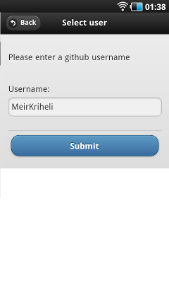
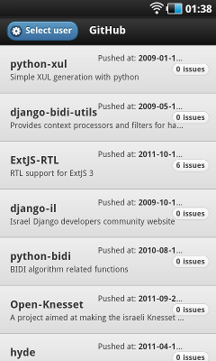
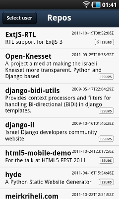

Mobile Web Frameworks
~~~~~~~~~~~~~~~~~~~~~~~~~~~~~~~~~~~~

HTML 5 Fest Oct. 2011

Html vs Native
-----------------

.. class:: incremental

* No access to hardware features
* With PhoneGap it can
* No need for multiple apps per platform
* Instant updates (No app store policies)
* Reuse html, css and JS knowledge
* Browser limits (e.g: cross domain)

Financial Times test case
--------------------------------

.. class:: incremental

* Apple takes 30% of subscription revenue
* Apple wants to control subscriber data (advertising)
* Pulled it from app store, rewritten with html 5
* More traffic compared to the native app
* Source: Reuters, `FT Web-based app more popular than app sold in Apple store`_

.. _FT Web-based app more popular than app sold in Apple store: http://www.reuters.com/article/2011/09/22/us-ft-idUSTRE78L49Q20110922

Mobile frameworks features
---------------------------

.. class:: incremental

* Lightweight (vs. full blown widget frameworks)
* Declarative (markup driven) configuration
* Native looking widgets
* Touch events
* Animations, Theming (it's css after all)
* Data integration (local storage, ajax etc..)

Our sample app
----------------

Git hub repositories viewer for a specific user.

Sample code at `html5-mobile-demo`_ repo on github:

https://github.com/MeirKriheli/html5-mobile-demo

.. _html5-mobile-demo: https://github.com/MeirKriheli/html5-mobile-demo

.. class:: jquery

jQuery mobile
----------------

.. class:: incremental

* Dual license: MIT or GPL
* Declarative
* Pages, dialogs, toolbars, buttons, forms, lists
* Documentation: OK
* Unstable APIs in previous release (seems better since 1.0rc2 landed)

.. class:: jquery

jQuery mobile 
-------------------

.. class:: center

Demo

.. class:: sencha

Sencha Touch
--------------

.. class:: incremental

* License: GPL or Commercial
* Programmatic
* Documentation: Very Good
* Feature rich (Widgets and data, MVC)
* Webkit only

.. class:: sencha

Sencha Touch
-------------------

.. class:: center

Demo

.. class:: sencha

Sencha Touch
--------------

* Was a simple demo
* Provides all that's needed for an MVC apps

.. class:: dojo

Dojo Mobile
-------------

.. class:: incremental

* BSD or Academic Free License
* Declarative or programmatic
* Documentation: Usable, in flux
* Lots of things in flux 1.7 release (rc1 right now)
* Good extra tools (build, AMD format etc)

.. class:: dojo

Dojo mobile
----------------

.. class:: center

Demo

.. class:: dojo

Dojo mobile
----------------

* There's also app and models
* things are in a flux

RTL supprot ?
--------------

.. class:: incremental

* No way
* I Might add support to jquery-mobile if time permits
* In practice: When hell freezes over :(

Summary
------------

.. class:: conclusion

.. table::

    ============== ============== ============== =============== ================
    Framework          Widgets        MVC         Documentation      License
    ============== ============== ============== =============== ================
    jQuery Mobile   Basic         No             Good            MIT/GPL
    Sencha Touch    Rich          Yes            Very Good       GPLv3/Commercial
    Dojo Mobile     Rich          In flux        Meh             BSD/Academic
    ============== ============== ============== =============== ================

Links
----------

- `jQuery mobile <http://jquerymobile.com/>`_,
  `Docs and demos <http://jquerymobile.com/demos/1.0rc2/>`_
- `Dojo mobile <http://dojotoolkit.org/features/mobile>`_,
  `tutorial <http://dojotoolkit.org/documentation/>`_,
  `showcase <http://chrism.dojotoolkit.org/mobile-rc1/release/demos/demos/mobileGallery/demo-iphone.html>`_
- `Sencha Touch <http://www.sencha.com/products/touch/>`_, `demos <http://www.sencha.com/products/touch/demos/>`_
- `10 Mobile Application Frameworks For Easy Development <http://skytechgeek.com/2011/09/10-mobile-application-frameworks-for-easy-development/>`_ lists more frameworks

Contact
----------

- Meir Kriheli
- http://meirkriheli.com
- mkriheli@gmail.com

.. footer:: html5 fest Oct. 2011
